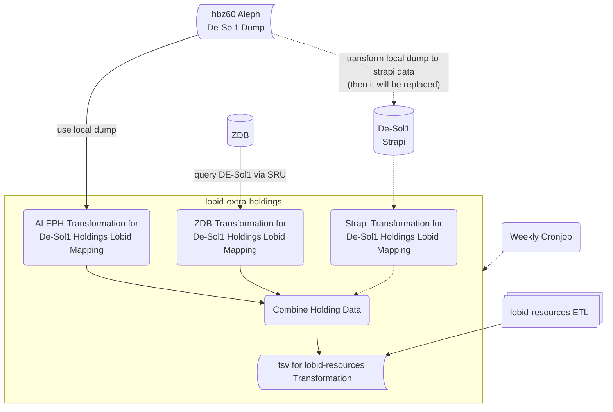

# lobid-extra-holdings
Non-Alma holdings for lobid-resources (currently only DE-Sol1).

The holding for DE-Sol1 are provided as MAB and ALEPH Seq files, and for ZDB related resources as SRU/Marc records comining bibliographic as well as holding in on collection element . Find examples in `test/input`. Holdings are provided in separate records and items for the same resource need to be merged as different objects in `hasItem` for a single resource. Each item in `hasItem` represents a single holding item.

The concept is the following:

Currently we are in the works of setting up the strapi that will replace the static ALEPH data transformation.

## To run transformation workflow process the flux file with your current metafacture runner.

For the transformations Metafacture is used. A runner is included in the repo.

Paths in the following CLI commands may need to be adjusted.

### For test purposes run:

`bash harvestHoldings_test.sh './metafix-core/flux.sh'`

If you want to update the testfiles for SRU you have to undo the outcommenting of the initial workjflow part of `flux/zdbSru2De-Sol1Holdings_marc_test.flux`

### For complete prod bulk run:
You need to have an aleph seq file placed in `prod/input` as well as an internet connection running to fetch data from SRU as well as from lobid resources.

#### Transformation of MAB Data:
`bash harvestHoldings_prod.sh './metafix-core/flux.sh'`
