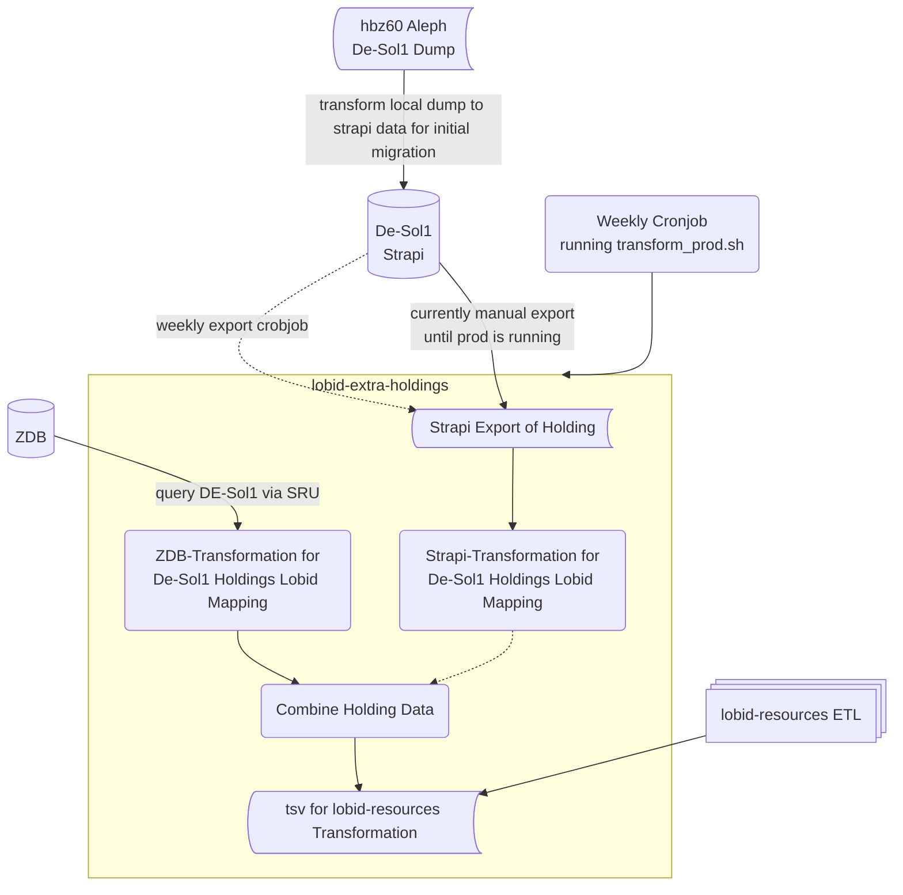

# lobid-extra-holdings

Non-Alma holdings for lobid-resources (currently only DE-Sol1).

Holdings for DE-Sol1 are provided in two ways:

- as ndjson export from the productive strapi-de-sol1 database that was initially populated with data from the ALEPH Seq files
- for ZDB related resources as SRU/Marc records combining bibliographic as well as holding information in one collection element
 
The concept is the following:

Currently we are in the works of setting up the strapi that will replace the static ALEPH data transformation.

Find examples in `test/input`. Holdings are provided in separate records and items for the same resource need to be merged into a single resource as different objects in `hasItem`. Each item in `hasItem` represents a single holding item.

## Prerequisites

### Metafacture

For the metadata transformations [Metafacture](https://metafacture.org/) is used. Until the SRU opener is part of an upcoming Metafacture release (see: https://github.com/metafacture/metafacture-core/issues/510), a runner is included in the repo, which is used in the following CLI commands.

### DE-Sol1 Strapi

In order to import data into strapi and harvest the holdings from strapi,  a running strapi instance for lobid-extra-holdings is needed. [Look here on how you set up a strapi-extra-holding instance locally.](https://github.com/hbz/strapi-extra-holdings) The strapi instance replaces the static aleph data transformation since it allows to add, delete and change holding information.

## Transformations

### Transform aleph seq data for strapi

In order to import the Aleph Data into strapi it has to be transformed to match the structure of the contentTypes in strapi.
This transformation can be run with:

Test: `./metafacture-core/flux.sh flux/mab2De-Sol1Holdings_seq2strapi_test.flux`

Prod: `./metafacture-core/flux.sh flux/mab2De-Sol1Holdings_seq2strapi_prod.flux`

### Import transformed data into strapi

When the strapi instance is running you can import the result of the previous transformation with:

Test: `./metafacture-core/flux.sh flux/mab2De-Sol1_strapiImport_test.flux API_TOKEN=... PATH="holdings"`

Prod: `./metafacture-core/flux.sh flux/mab2De-Sol1_strapiImport_prod.flux API_TOKEN=... PATH="holdings"`

The API key can be generated in the GUI of the strapi instance under 'Settings'.

### Export the data from strapi and save it locally

In order to use the strapi data in production for further processing it has to be exported to: `prod/input/strapi-export-holdings.ndjson`. This process will be automated when a productive strapi instance is deployed.

For test purposes `test/input/strapi-export-holdings.ndjson` exists.

## Creating a mapping file of extra holdings for lobid-resources

This process harvests SRU holdings and processes the locally saved strapi export.

### For test purposes run:

`bash harvestHoldings_test.sh ./metafacture-core/flux.sh`

The tests use local sample files of the strapi export as well as a small sample of the SRU harvest. If you want to update the test files for SRU you have to undo the outcommenting of the initial workjflow part of `flux/zdbSru2De-Sol1Holdings_marc_test.flux`

### Transformation of strapi and SRU data for production:

`bash harvestHoldings_prod.sh ./metafacture-core/flux.sh`
